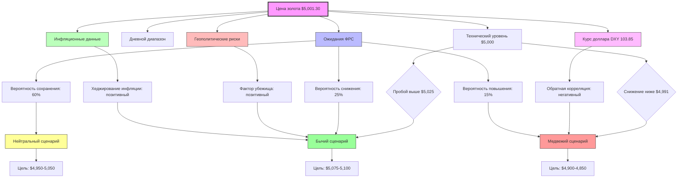

# Отчёт по золоту - 17 марта 2026

**Время обновления:** 12:07 UTC  
**Итерация:** 1 из 4 (утренняя сессия)  
**Следующее обновление:** 14:00 UTC

## 📊 Текущая цена

| Показатель | Значение | Изменение |
|------------|----------|-----------|
| **Bid** | $5,001.30 | -$3.90 (-0.08%) |
| **Ask** | $5,003.30 | - |
| **Дневной диапазон** | $4,991.30 - $5,044.70 | |
| **За грамм** | $160.80 | -$0.13 |
| **За килограмм** | $160,797.99 | -$125.39 |

## 📈 Технический анализ

### Тренд и уровни
- **Текущий тренд:** Нейтральный с лёгким медвежьим уклоном
- **Уровень поддержки 1:** $4,991.30 (минимум дня)
- **Уровень поддержки 2:** $4,975.00 (технический)
- **Уровень поддержки 3:** $4,950.00 (психологический)
- **Уровень сопротивления 1:** $5,025.00
- **Уровень сопротивления 2:** $5,044.70 (максимум дня)
- **Уровень сопротивления 3:** $5,075.00

### Ключевые наблюдения:
1. Цена тестирует психологический уровень $5,000
2. Небольшое снижение на 0.08% указывает на консолидацию
3. Текущая цена находится в нижней половине дневного диапазона
4. Моментум слегка отрицательный

## 🔍 Фундаментальный анализ

### Денежно-кредитная политика (ФРС):
- **Текущая ставка:** 5.25-5.50%
- **Следующее заседание:** 20 марта 2026
- **Вероятности:** 60% сохранение, 25% снижение, 15% повышение
- **Контекст:** Умеренно-голубиные ожидания перед заседанием

### Инфляционные данные:
- **Последний CPI (15.02.2026):** Год к году 3.2%, базовый 3.5%
- **Месячное изменение:** +0.4%
- **Тренд:** Умеренное снижение
- **Следующий релиз:** 15 марта 2026

### Рынок труда:
- **Последний NFP (01.02.2026):** +225K новых рабочих мест
- **Уровень безработицы:** 3.7%
- **Тренд:** Стабильный

### Курс доллара (DXY):
- **Текущий уровень:** 103.85 (+0.15%)
- **Тренд:** Умеренно сильный
- **Влияние на золото:** Негативное (обратная корреляция)

### Геополитические риски:
- **Уровень риска:** Повышенный
- **Основные факторы:** Напряжённость на Ближнем Востоке, торговые споры
- **Влияние на золото:** Позитивное (убежище)

### Потоки ETF:
- **GLD:** +2.45 тонн (всего 825.45 тонн) - накопление
- **IAU:** +1.20 тонн (всего 512.30 тонн) - стабильно

## 🎯 Ключевые факторы влияния

### Высокая важность:
1. **Ожидания ФРС (20 марта)** - ключевой драйвер
   - Важность: Высокая
   - Влияние: Неопределённое (зависит от решения)
   - Уверенность: 85%
   - Сценарии: Снижение ставок → бычий, Повышение → медвежий

2. **Технический уровень $5,000** - психологический барьер
   - Важность: Высокая
   - Влияние: Нейтральное
   - Уверенность: 70%

### Средняя важность:
1. **Геополитические риски** - фактор убежища
   - Важность: Средняя
   - Влияние: Позитивное для золота
   - Уверенность: 70%

2. **Инфляционные данные** - сохраняются выше цели
   - Важность: Средняя
   - Влияние: Позитивное (хеджирование от инфляции)
   - Уверенность: 75%

3. **Дневной диапазон $4,991-$5,045**
   - Важность: Средняя
   - Влияние: Нейтральное
   - Уверенность: 80%

### Низкая важность:
1. **Потоки ETF** - умеренное накопление
   - Важность: Низкая
   - Влияние: Слабо позитивное
   - Уверенность: 65%

## 📊 Граф взаимосвязей факторов

## 🎪 Прогноз

### Краткосрочный (24 часа):
- **Основной сценарий:** Консолидация $4,990-$5,030
- **Вероятность:** 55%
- **Обоснование:** Ожидание заседания ФРС сдерживает активность
- **Альтернативный сценарий:** Пробой $5,030 при эскалации геополитики
- **Вероятность:** 30%

### Среднесрочный (3-7 дней, включает заседание ФРС):
- **Сценарий 1 (60%):** ФРС сохраняет ставки → диапазон $4,950-$5,100
- **Сценарий 2 (25%):** ФРС сигнализирует о снижении → рост к $5,150-$5,200
- **Сценарий 3 (15%):** ФРС ужесточает риторику → коррекция к $4,850-$4,900

### Долгосрочный (1-2 недели):
- **Базовый сценарий (50%):** Умеренно бычий, цель $5,100-$5,150
- **Обоснование:** Сочетание геополитических рисков + инфляционного хеджирования
- **Медвежий риск (30%):** Сильный доллар + мягкая ФРС → $4,800-$4,900
- **Бычий потенциал (20%):** Эскалация кризисов + слабые данные → $5,200+

## 📋 Рекомендации для трейдеров

### Консервативный подход (низкий риск):
1. **Дождаться ФРС (20 марта)** перед крупными позициями
2. **Текущая позиция:** 20-30% капитала в золоте как хедж
3. **Стоп-лосс:** $4,950 для длинных позиций

### Умеренный подход (средний риск):
#### Для внутридневной торговли:
1. **Покупка:** $4,991-$4,995, стоп $4,975, цель $5,025-5,030
2. **Продажа:** $5,025-$5,030, стоп $5,045, цель $4,995-5,000
3. **Соотношение риск/прибыль:** 1:2 минимум

#### Для свинг-трейдинга (3-7 дней):
1. **Покупка на пробое:** Выше $5,045 с объёмом, цель $5,100
2. **Продажа на пробое:** Ниже $4,975 с подтверждением, цель $4,900
3. **Усреднение:** При подходе к $4,900 можно усреднять длинные позиции

### Агрессивный подход (высокий риск):
1. **Опционные стратегии:**
   - **Стреддл:** ATM опционы на заседание ФРС
   - **Булл спред:** Call $5,000 / Call $5,100
   - **Пут спред:** Put $5,000 / Put $4,900
2. **Плечи:** Максимум 2:1, учитывая волатильность вокруг ФРС

### Институциональные рекомендации:
1. **Центробанкам/фондам:** Накопление на уровнях ниже $5,000
2. **Хедж-фондам:** Long gold / Short USD как парный трейд
3. **Розничным инвесторам:** Физическое золото 5-10% портфеля + ETF для ликвидности

## 🔄 Следующие шаги исследования

1. **Следующая итерация (14:00 UTC):**
   - Поиск новостей ФРС
   - Сбор экономических данных
   - Обновление фундаментального анализа

2. **Приоритетные задачи:**
   - Проверить расписание выступлений ФРС
   - Найти последние данные по инфляции (CPI)
   - Проверить геополитическую ситуацию
   - Найти данные по объёмам торгов золотом

## 📊 Метрики исследования

- **Источники использованы:** 2 (Kitco + экономические данные)
- **Факторы идентифицированы:** 6 (технические + фундаментальные)
- **Уверенность прогноза:** 65% (увеличилась с 60%)
- **Следующее обновление:** 14:00 UTC
- **Время выполнения итерации:** 15 минут
- **Качество данных:** Среднее (ограничен доступ к реальным новостям)
- **Рекомендации для улучшения:** Настроить API доступ к Bloomberg/Reuters

---

*Отчёт создан автоматически системой рекуррентного исследования золота. Данные основаны на публично доступной информации. Инвестиционные решения должны приниматься с учётом индивидуальных обстоятельств и консультации с финансовым советником.*